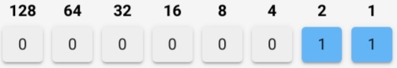
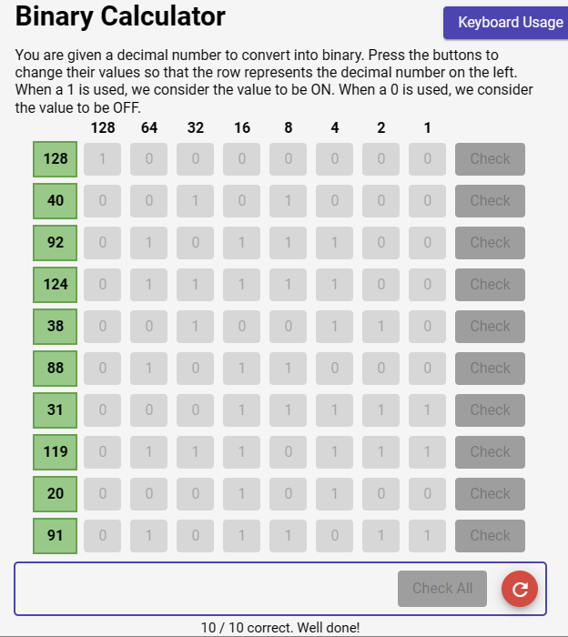

## Graded Quiz: How to Count in Binary

__Grade received: 100%__

 

## Question 1

 
In this activity, you will use the tool below to convert a decimal number into binary form. 

Remember, in binary, the value is considered to be “ON” when a 1 is used. When a 0 is used, the value is considered to be **“OFF.”**

Click the binary bits necessary to compute the decimal value on the left column. There are 10 exercises to complete.

For example, the picture below represents the number 3 in binary. 

When you're done, click the **"Check Answers"** button. To submit this quiz for a grade, close the full screen quiz and click the **"Submit Quiz"** button. 

 

### **Quiz consideration:**

1. To complete the quiz, you will need to get 100% accuracy.

2. If you choose to try the quiz again, make sure to click the **“Try Again”** button before continuing. If not, the plugin will allow you to practice the quiz but will not allow you to submit your grade.

3. When you’re done, make sure you have closed the fullscreen quiz and click the **“Submit Quiz”** button to earn a grade.

> Good luck!

 

